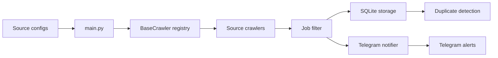

# AI-Job-Alert-Bot

AI-Job-Alert-Bot is a Python-based job intelligence pipeline that watches software engineering and AI job sources, filters for relevant roles, stores results in SQLite, and sends Telegram alerts for new matches.

## Overview

The project is designed around small, swappable modules so new sources, filters, and notification channels can be added without rewriting the core runner.

## Architecture



## Features

- Multi-source crawler architecture with automatic registration.
- Supported sources: LinkedIn Jobs, Greenhouse, Lever, Ashby, Wellfound, YC Jobs, and official company career pages.
- Allowlist and denylist job filtering.
- SQLite persistence for jobs, companies, and alerts.
- Duplicate detection by job ID, URL, company/title, and hash.
- Markdown-formatted Telegram notifications.
- Priority company alerts powered by `priority_companies.json`.
- Streamlit dashboard for search, filtering, scores, and history tracking.
- Docker support for the bot and dashboard.
- Scheduled GitHub Actions workflow with retries and cached state.

## Installation

1. Create a Python 3.11+ environment.
2. Install dependencies with `pip install -r requirements.txt`.
3. Create a `.env` file from `.env.example`.

## Configuration

Required environment variables:

- `TELEGRAM_TOKEN`
- `CHAT_ID`
- `LOG_LEVEL`
- `LOCATIONS`
- `KEYWORDS`

Optional environment variables:

- `RESUME_PATH` points to a plain-text resume file used for match scoring.

Optional source configuration:

- `SOURCES_CONFIG` can contain a JSON array of crawler definitions.
- If `SOURCES_CONFIG` is not set, `main.py` also looks for `state/sources.json`.

Example source config:

```json
[
	{"source": "greenhouse", "board_token": "example", "company": "Example Co"},
	{"source": "lever", "company_slug": "example", "company": "Example Co"},
	{"source": "ashby", "career_page_url": "https://jobs.ashbyhq.com/example", "company": "Example Co"},
	{"source": "linkedin", "search_url": "https://www.linkedin.com/jobs/search/...", "company": "LinkedIn"},
	{"source": "wellfound", "company_slug": "example", "company": "Example Co"},
	{"source": "yc", "company_slug": "example", "company": "Example Co"},
	{"source": "career_page", "career_page_url": "https://careers.example.com/jobs", "company": "Example Co"}
]
```

## GitHub Actions

The workflow in `.github/workflows/job-alert-bot.yml` runs every 15 minutes, installs Python plus Chrome tooling, restores the cached `state/` directory, installs dependencies, and runs the crawler with retries.

## Dashboard

Run the dashboard with:

```bash
streamlit run dashboard/app.py
```

The dashboard shows jobs found, relevant jobs, today's jobs, priority companies, search and filters, computed match scores, apply links, and a manual job-history form.

## Docker

Run the platform with:

```bash
docker compose up --build
```

The `bot` service loops on a configurable interval using `BOT_INTERVAL_SECONDS` and the `dashboard` service exposes Streamlit on port `8501`.

## Priority Companies

Edit `priority_companies.json` to define companies that should be labeled as priority in Telegram alerts and highlighted in the dashboard.

## Screenshots

Placeholder for future screenshots of alerts, logs, dashboard, and workflow runs.

Example source config:

```json
[
	{"source": "greenhouse", "board_token": "example", "company": "Example Co"},
	{"source": "lever", "company_slug": "example", "company": "Example Co"},
	{"source": "ashby", "career_page_url": "https://jobs.ashbyhq.com/example", "company": "Example Co"},
	{"source": "linkedin", "search_url": "https://www.linkedin.com/jobs/search/...", "company": "LinkedIn"},
	{"source": "wellfound", "company_slug": "example", "company": "Example Co"},
	{"source": "yc", "company_slug": "example", "company": "Example Co"},
	{"source": "career_page", "career_page_url": "https://careers.example.com/jobs", "company": "Example Co"}
]
```

## Telegram Setup

1. Create a Telegram bot with BotFather.
2. Add the bot token to `TELEGRAM_TOKEN`.
3. Add the target chat ID to `CHAT_ID`.
4. Confirm the bot can post to the target chat.

## Roadmap

- RemoteOK source.
- AI ranking and resume matching.
- Email, Discord, and Slack alerts.
- Web dashboard and REST API.

## Contributing

1. Keep changes modular and focused.
2. Add validation for new behavior.
3. Prefer reusable helpers over source-specific duplication.

## License

MIT. See [LICENSE](LICENSE).
